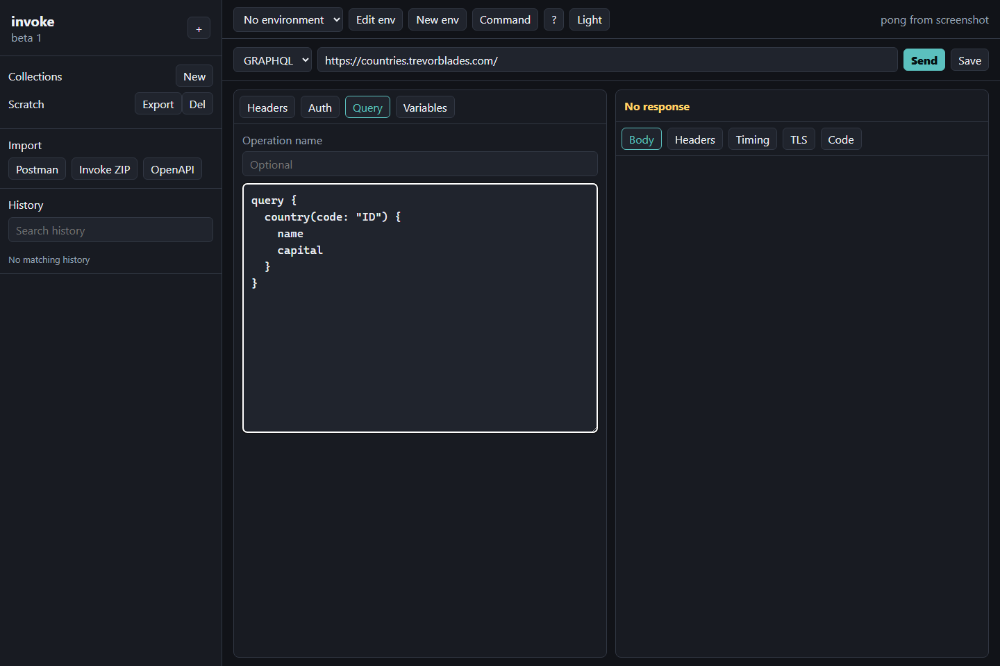
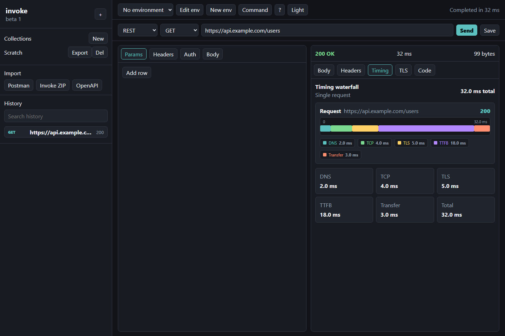
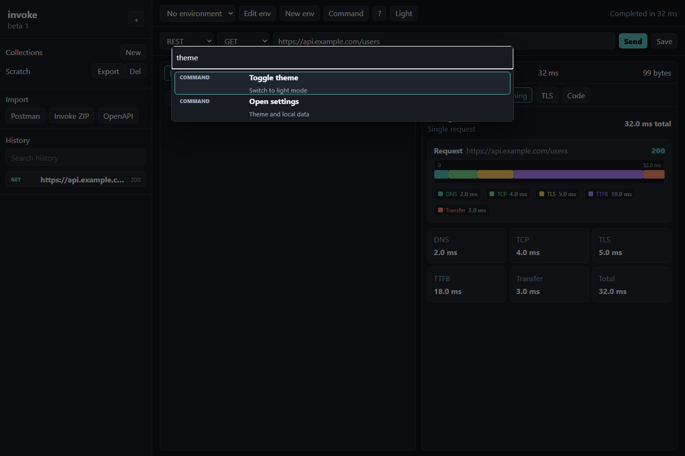
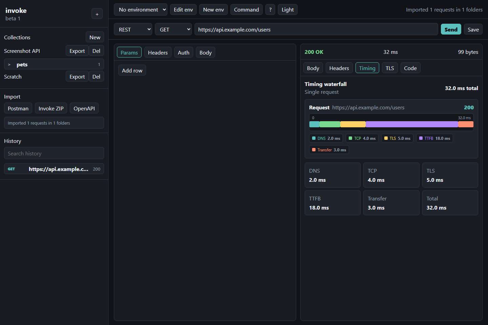

# invoke

A privacy-first API development and testing platform. Browser UI, local-first storage, and a Go executor for accurate HTTP timing.

No account. No cloud sync. Your collections, environments, and history live in your browser's IndexedDB.

## Features

### Core Requests
- REST methods: `GET`, `POST`, `PUT`, `PATCH`, `DELETE`, `HEAD`, `OPTIONS`
- GraphQL with query, variables, shared headers, and save/load
- Headers, query params, JSON/raw bodies
- `{{variable}}` resolution across environment, collection, folder, request, and session scopes
- Browser-local collections, nested folders, environments, and searchable history

### Real-time Protocols
- **WebSocket** — Go-backed connect/disconnect, custom upgrade headers, subprotocols, message composer, chronological log
- **gRPC** — reflection-backed method discovery, unary JSON/protobuf execution, metadata
- **SSE streaming** — real-time token-by-token display for Server-Sent Events

### Auth & Security
- Basic, Bearer, API key, Digest, OAuth2 client credentials, AWS SigV4
- mTLS and custom CA: PEM client certificate, key, CA bundle, SNI override, TLS verification controls

### Scripting & Automation
- Pre-request and post-response JavaScript with a browser Worker sandbox, `test()`, and `expect()` helpers
- **Flow runner/editor** — sequential flows with extraction, conditions, fixed-count and conditional loops, delays, hooks, cancellation, and a Settings-based visual editor
- **Assertions** — pass/fail rules on status code, headers, and JSON body fields, shown inline after each request

### Mock Server
Browser-managed in-memory routes served by the Node proxy at `/mock/*`, with path params, header/query/bodyJsonPath conditions, dynamic variables, latency, and request logs.

### Data Tools
- **Response diff** — structural side-by-side diff between any two saved responses
- **GraphQL schema autocomplete** — on-demand introspection wired into CodeMirror

### Import & Export
- Import: Postman v2.1, Insomnia v4, Hoppscotch, OpenAPI 3.x, cURL paste
- Export: YAML zip

### Code Export
cURL, fetch, Node fetch, axios, Python `requests`/`httpx`, Go, Java, Kotlin, Ruby, PHP, C#, Rust, PowerShell, HTTPie.

### UX
- Go HTTP executor with DNS/TCP/TLS/TTFB/transfer/total timing and a waterfall view
- Light/dark theme, keyboard shortcuts, shortcut help, and command palette

## Screenshots









## Architecture

```text
Vue UI + @invoke/core (browser)
  -> Hono proxy (Node.js)
  -> Go HTTP executor (gRPC)
  -> target API
```

The browser owns product state and local persistence. The Node server is intentionally thin: it forwards resolved requests to the Go sidecar and proxies SSE streams to the UI. The Go executor performs network I/O with `net/http/httptrace` so the UI can show DNS, TCP, TLS, TTFB, transfer, and total timing.

## Getting Started

### Requirements

- Node.js 20+
- pnpm 9+
- Go 1.23+
- Buf CLI, only when regenerating protobuf code

PowerShell may block `pnpm.ps1`; use `pnpm.cmd` if that happens.

### Install

```bash
pnpm install
```

### Run

Start three terminals:

```bash
pnpm executor:dev
pnpm dev:server
pnpm dev:ui
```

Open `http://localhost:3000`.

## Protobuf

The executor service is defined in `proto/executor.proto`. Generated Go code is checked in under `executor/internal/executorpb`.

```bash
pnpm proto:generate
```

## Self-Hosted

```bash
docker compose up --build
```

Open `http://localhost:8080`.

## Verification

```bash
pnpm lint
pnpm build
pnpm test
pnpm e2e
go test ./executor/...
```

`pnpm e2e` starts the Go executor, Hono server, Vite UI, and a local mock target API, then runs the happy paths in Chromium.
