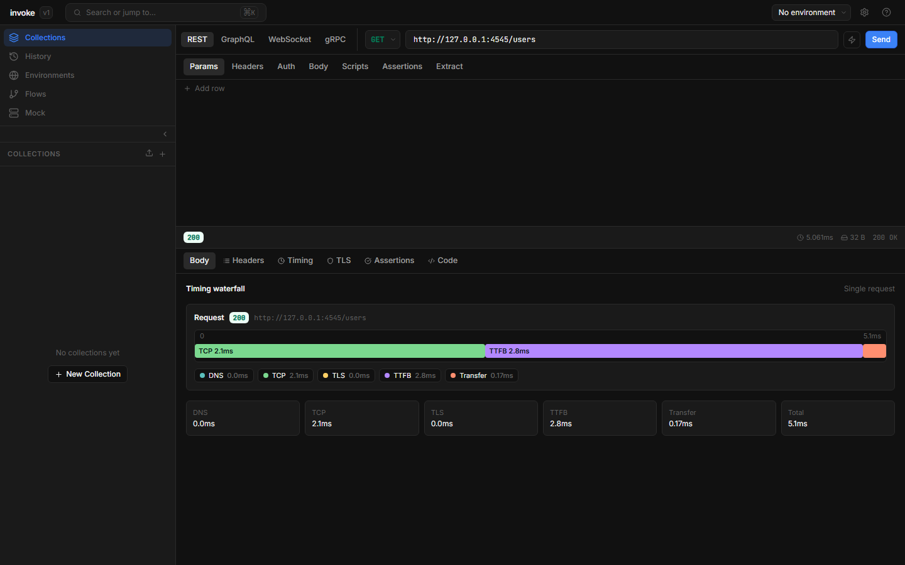
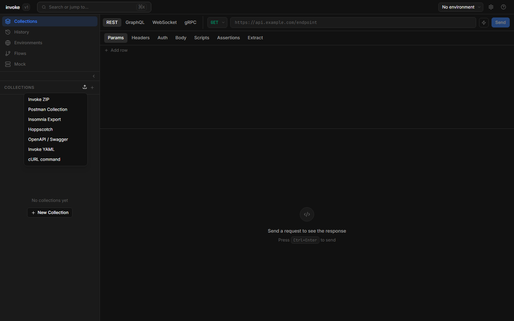
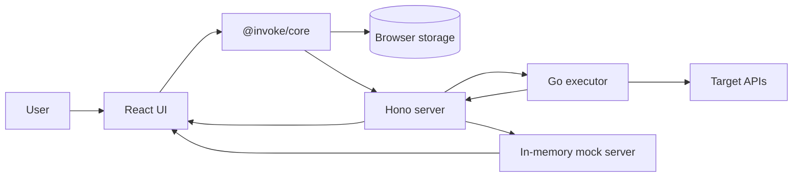

# invoke

invoke is a local-first API development and testing platform for developers who want a fast browser UI, self-hosting, accurate network timing, and no mandatory account or cloud sync.

It combines a React web app, a TypeScript core engine, a thin Node.js proxy, and a Go executor. The browser owns the product state, the core engine handles API-client behavior, and the Go executor performs network I/O with low-level timing data that browser-only tools cannot capture reliably.

## Overview

- **Local-first by default** - collections, environments, history, flows, mock routes, and settings live in browser storage.
- **No required account** - use the app without sign-up, user management, or a hosted workspace.
- **Protocol-aware** - build and inspect REST, GraphQL, WebSocket, gRPC, and streaming HTTP requests in one interface.
- **Accurate execution data** - capture detailed HTTP timing through a Go executor using `net/http/httptrace`.
- **Repeatable API checks** - run assertions, extraction rules, scripts, and request flows locally.
- **Portable API work** - import existing API work, export collection data, generate code snippets, and self-host with Docker Compose.

## Features

### Request Building

invoke can create, send, save, and inspect API requests across multiple protocols:

- REST requests with common HTTP methods.
- GraphQL queries with variables, schema introspection, and schema browsing.
- WebSocket connections with custom upgrade headers, subprotocols, auth headers, TLS options, message composer, and chronological message log.
- WebSocket polling for received messages and connection events.
- gRPC server reflection and unary calls with metadata, TLS/plaintext modes, mTLS material, and protobuf JSON request/response handling.
- Streaming HTTP responses through the Go executor and server-side forwarding.

REST requests support headers, query parameters, request bodies, auth configuration, variable resolution, timeouts, TLS options, and proxy settings.

### Response Inspection

The response view is designed for debugging:

- Status, headers, body, request & response size, and timing summary.
- JSON and raw response display.
- DNS, TCP, TLS, TTFB, transfer, and total timing.
- Timing waterfall visualization.
- Redirect tracking with per-hop response details.
- TLS certificate details for HTTPS requests.
- Assertion results after request execution.
- History entries that preserve request and response context.

### Collections and Environments

API work is organized locally in the browser:

- Collections for saved requests.
- Nested folders for larger APIs.
- Environments for local, staging, production, or custom variable sets.
- Scoped variables across environment, collection, folder, request, session, and flow contexts.
- Dynamic variables such as UUIDs and timestamps.
- Searchable history for previously executed requests.

The core variable system resolves `{{variable}}` placeholders before execution, so saved requests can move between environments without duplicating URLs, tokens, or host-specific values.

### Auth, TLS, and Network Options

invoke includes common authentication and transport options used by real services:

- No auth.
- Basic auth.
- Bearer token.
- API key in header or query.
- OAuth2 client credentials.
- Digest auth.
- AWS SigV4 signing.
- mTLS client certificates.
- Custom CA bundles.
- TLS verification controls.
- HTTP proxy configuration.

These options are resolved into the final outgoing request before the Node server forwards execution to the Go sidecar.

### Testing and Automation

invoke includes local testing primitives so requests can become repeatable checks:

- Assertions for status, headers, response time, JSONPath values, regex checks, and JSON Schema validation.
- Extraction rules that pull values from response bodies, headers, status, timing, or cookies.
- Session and flow variables for chaining request data.
- Pre-request and post-response scripts.
- Browser Worker script execution path with a Node/test fallback.
- Postman-style `test()` helper and `expect()` matchers.
- Flow runner with request steps, delays, conditions, loops, extraction, cancellation, progress hooks, and saved flow persistence.
- Browser flow editor in Settings with saved flows, request/delay steps, reordering, execution, and live step logs.

### Diffing and History

Response history is useful for more than re-running a request:

- Search previous executions.
- Restore a historical request into the builder.
- Compare saved responses.
- Diff structured JSON responses.
- Fall back to text diffing for non-JSON bodies.
- Review assertion results from previous runs.

### Mock Server

invoke can run browser-managed mock routes through the Node server:

- Mock endpoints are served under `/mock/*`.
- Mock server management is available from the app settings.
- Routes are configured from browser state.
- Path parameters are supported.
- Conditions can inspect headers, query values, and JSONPath body values.
- Responses can include dynamic variables.
- Latency can be configured.
- Request logs show incoming mock traffic.

Mock state is intentionally local and in-memory on the Node side. The browser remains the owner of the mock configuration and can re-sync it when needed.

### Import, Export, and Code Generation

invoke is built to fit existing API workflows:

Supported imports:

- Postman collection format.
- OpenAPI 3.x.
- cURL paste.
- Insomnia export.
- Hoppscotch export.
- invoke ZIP/YAML export format.

Code export targets include:

- cURL.
- JavaScript `fetch`.
- Node `fetch`.
- Node `axios`.
- Python `requests`.
- Python `httpx`.
- Go `net/http`.
- Java OkHttp.
- Kotlin OkHttp.
- Ruby `Net::HTTP`.
- PHP Guzzle.
- C# `HttpClient`.
- Rust `reqwest`.
- PowerShell.
- HTTPie.

## Screenshots

| GraphQL editor | Timing waterfall |
| --- | --- |
|  |  |

| Command palette | Import options |
| --- | --- |
|  |  |

## Architecture



The browser is the source of truth for workspace data. Requests are resolved in the UI and core layer, forwarded through the Node server, executed by the Go sidecar when network access or timing detail is needed, and returned to the response viewer.

### Browser UI

The React app is the main product surface. It renders the request builder, response viewer, collection tree, environment editor, protocol clients, history, flow editor, settings, and import/export tools.

The UI imports `@invoke/core` directly. That keeps the app responsive and lets most business logic run near the browser-owned data.

### Core Engine

`@invoke/core` is a TypeScript package that contains the shared product logic:

- Request and response types.
- Variable resolution.
- Dynamic variables.
- Auth helpers.
- Assertions.
- Extraction.
- Diffing.
- Flow execution.
- Import/export.
- Code generation.
- Storage helpers.
- Script execution helpers.

The browser-safe core entry point must not depend on Node-only APIs. This matters because the UI build should work without leaking modules such as `fs`, `path`, native gRPC clients, or server-only sandbox implementations into the browser bundle.

### Node Server

The server is intentionally thin. It does not own the user's collections or environments in the local-first model.

Its responsibilities are:

- Forward resolved HTTP requests to the Go executor.
- Forward streaming responses.
- Relay WebSocket operations.
- Proxy gRPC reflection and unary execution.
- Host the in-memory mock server.
- Serve as the bridge between browser APIs and the Go sidecar.

### Go Executor

The Go executor performs network operations that need more control than browser APIs provide:

- HTTP request execution.
- DNS, TCP, TLS, TTFB, transfer, and total timing.
- TLS certificate inspection.
- Redirect handling.
- Streaming response execution.
- WebSocket connection management.
- gRPC reflection and unary execution.
- mTLS and custom CA handling.

The executor communicates with the Node server through gRPC. The contract lives in `proto/executor.proto`.

## Local Data Model

invoke's local-first model is simple:

- Collections live in browser storage.
- Environments live in browser storage.
- Request history lives in browser storage.
- Saved flows live in browser storage.
- Mock configuration is managed by the browser.
- No account is required to use the app.
- No database is required for local or self-hosted use.

The Node server and Go executor see resolved requests when you execute them, because they have to send the network traffic. They are not the source of truth for your workspace data.

Self-hosting keeps the proxy and executor under your control. This is important when testing internal APIs, private services, local development servers, or endpoints that use sensitive credentials.

## Repository Structure

```text
.
|-- executor/                 Go executor and gRPC service implementation
|-- packages/
|   |-- core/                 TypeScript core engine
|   |-- server/               Hono server, proxy routes, streaming, mock host
|   `-- ui/                   React browser application
|-- proto/                    Executor protobuf contract
|-- tests/e2e/                Playwright end-to-end tests
|-- docs/                     Product and implementation documentation
|-- Dockerfile.executor       Executor image
|-- Dockerfile.server         Server image
|-- Dockerfile.ui             UI image
|-- docker-compose.yml        Self-hosted production compose file
|-- docker-compose.dev.yml    Development compose file
`-- package.json              Root workspace scripts
```

## Getting Started

### Requirements

- Node.js 20 or newer.
- pnpm 9 or newer.
- Go.
- Docker and Docker Compose for containerized self-hosting.
- Buf CLI only when regenerating protobuf code.

PowerShell may block `pnpm.ps1` depending on local execution policy. If that happens, use `pnpm.cmd`.

### Install Dependencies

```bash
pnpm install
```

### Run the Full Local Stack

The easiest local development command starts the executor, server, and UI together:

```bash
pnpm dev:all
```

Open:

```text
http://localhost:3000
```

### Run Services Separately

If you prefer separate terminals:

```bash
pnpm executor:dev
```

```bash
pnpm dev:server
```

```bash
pnpm dev:ui
```

Open:

```text
http://localhost:3000
```

## Self-Hosting

Run the complete stack with Docker Compose:

```bash
docker compose up --build
```

Open:

```text
http://localhost:8080
```

The compose stack builds and runs the UI, Node server, and Go executor. The UI is served through Nginx, the server handles API routes, and the executor performs outbound API calls.

## Development Commands

Root workspace commands:

```bash
pnpm dev
pnpm dev:all
pnpm dev:server
pnpm dev:ui
pnpm executor:dev
pnpm build
pnpm test
pnpm lint
pnpm e2e
pnpm proto:generate
pnpm executor:test
```

Useful package-level commands:

```bash
pnpm --filter @invoke/core test
pnpm --filter @invoke/core build
pnpm --filter @invoke/server test
pnpm --filter @invoke/server build
pnpm --filter @invoke/ui test
pnpm --filter @invoke/ui build
```

Go executor tests can also be run directly:

```bash
cd executor
go test ./...
```

## Verification

Before treating a change as ready, run:

```bash
pnpm lint
pnpm build
pnpm test
pnpm e2e
pnpm executor:test
```

`pnpm e2e` uses Playwright. The test setup starts the Go executor, Hono server, Vite UI, and a local mock target API before running browser tests.

For Go-only changes:

```bash
cd executor
go test ./...
```

For protobuf changes:

```bash
pnpm proto:generate
pnpm build
```

## Protobuf

The executor service contract is defined in:

```text
proto/executor.proto
```

Generated Go files are checked in under:

```text
executor/internal/executorpb
```

Regenerate protobuf output with:

```bash
pnpm proto:generate
```

Do not hand-write generated protobuf types. Update the `.proto` file and regenerate.

## Working With the Core Package

`@invoke/core` is the shared logic layer. Keep it framework-independent and browser-safe unless a module is explicitly server-only.

When adding to core:

- Keep browser-safe exports free of Node.js built-ins.
- Prefer pure functions for request transformation, assertions, code generation, import/export, and variable handling.
- Keep storage behind interfaces where possible.
- Add focused unit tests for behavior that can break saved work, imports, exports, variable resolution, assertions, or generated code.

Browser compatibility is verified through the UI build:

```bash
pnpm --filter @invoke/ui build
```

If the UI build fails because a Node module leaked into the browser bundle, fix the import boundary rather than masking it with a polyfill.

## Working With the Server

The server should stay small and operationally boring. It is a bridge, not the workspace database.

Expected server responsibilities:

- Validate incoming execution requests.
- Forward work to the Go executor.
- Stream responses back to the browser.
- Relay protocol-specific operations.
- Host mock routes from browser-provided configuration.
- Normalize errors into UI-friendly responses.

Avoid adding collection, environment, history, or flow CRUD routes unless the storage model changes deliberately.

## Working With the Executor

The executor is responsible for network correctness. Changes here should be tested with Go unit tests and, when possible, end-to-end browser coverage.

Important areas:

- Timing instrumentation.
- Redirect behavior.
- TLS and mTLS handling.
- Custom CA handling.
- Request cancellation and timeouts.
- Streaming responses.
- WebSocket lifecycle.
- gRPC reflection and unary execution.

Run:

```bash
cd executor
go test ./...
```

## Data Ownership

Because invoke is local-first, browser storage is important product state. Be careful with migrations and data shape changes.

When changing persisted data:

- Preserve existing IndexedDB data where possible.
- Add migrations instead of assuming a clean browser profile.
- Keep exported files readable and deterministic.
- Avoid changing import/export formats without compatibility handling.
- Test refresh and reload behavior after saving collections, environments, flows, and history.
