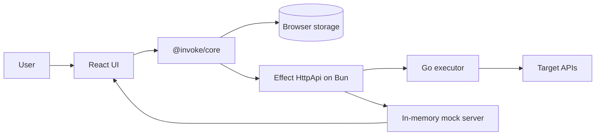

# invoke

Open-source API testing, development and documentation platform. Use [runinvoke.com](https://runinvoke.com) or self-host with Docker — no account required, all workspace data stays in your browser.

invoke combines a React UI, a TypeScript core engine, a thin Effect HttpApi server on Bun, and a Go executor. The browser owns workspace state, the core engine handles client-side API logic, and the Go executor performs network I/O with the low-level timing data.

## Features

- **Local-first** — collections, environments, history, flows, cookies, mock routes, and settings live in browser storage. No account, no database.
- **Multi-protocol** — REST, GraphQL, WebSocket, gRPC (unary, server-stream, client-stream, bidi), and streaming HTTP in one UI.
- **Accurate timing** — DNS, TCP, TLS, TTFB, transfer, and total timing via `net/http/httptrace` in Go, with a redirect-aware waterfall and per-attempt retry chart.
- **Repeatable checks** — assertions, extractions, pre/post scripts, request flows, collection runs, and batch runs across all protocols.
- **Portable** — import Postman, OpenAPI, Insomnia, Hoppscotch, HAR, cURL, and `grpcurl`; export OpenAPI, workspace JSON, and code snippets in 15+ languages.

A scannable [`docs/FEATURES.md`](docs/FEATURES.md) covers protocol coverage, auth, runners, mocks, imports/exports, and code-generation targets. The full requirements document is [`docs/PRD.md`](docs/PRD.md).

## Architecture



| Layer | Path | Responsibility |
|-------|------|----------------|
| **React UI** | `packages/ui` | Request builder, response viewer, runners, mock/webhook tools, flow editor, settings. Imports `@invoke/core` directly. |
| **Core engine** | `packages/core` | Browser-safe TypeScript: types, variable resolution, auth helpers, assertions, extraction, diffing, flow execution, run orchestration, import/export, code generation. Must not depend on Node-only APIs. |
| **Server** | `packages/server` | Thin bridge on `@effect/platform` HttpApi + Bun: forwards requests to the executor, relays gRPC/WebSocket over SSE, hosts the in-memory mock and webhook capture, handles the OAuth2 authorization-code callback. Exposes `/api/openapi.json` and a Scalar UI at `/api/docs`. |
| **Executor** | `executor/` | Network correctness in Go: HTTP/2, timing, redirects, mTLS, custom CAs, WebSocket lifecycle (`gorilla/websocket`), gRPC reflection (v1/v1alpha), unary + streaming, gRPC-Web, SSRF guard, NTLM auth. Speaks gRPC to the server (contract: `proto/executor.proto`). |

The browser is the source of truth for workspace data. The server and executor only see resolved requests at execution time.

## Getting Started

### Requirements

- **Node.js** ≥ 20
- **pnpm** ≥ 9 (UI install + workspace; pinned via `packageManager` in `package.json`)
- **Bun** ≥ 1 (server runtime — used by `dev:server`, `Dockerfile.server`, and `docker-compose.dev.yml`)
- **Go** (executor)
- **Docker** + **Docker Compose** (for self-hosting)
- **Buf CLI** (only when regenerating protobuf)

### Install

```bash
pnpm install
```

### Run the local stack

```bash
pnpm dev:all      # executor :50051 + server :4000 + UI :3000, labeled output
pnpm dev          # server :4000 + UI :3000 (skip executor — no real network timing)
```

Open: http://localhost:3000

To run services in separate terminals:

```bash
pnpm executor:dev   # Go executor on :50051
pnpm dev:server     # Bun + Effect HttpApi server on :4000
pnpm dev:ui         # Vite UI on :3000
```

## Self-Hosting

```bash
docker compose up --build
```

Open: http://localhost:8080

Three images are built: UI (Nginx serving the static bundle, proxying `/api/*` and `/health` to the server), server (Bun), and executor (Go). The compose file is `docker-compose.yml`; `docker-compose.dev.yml` is the development variant with bind mounts.

## Configuration

Both the server and the executor are configured through environment variables. Defaults work out of the box for local development and the bundled compose stack.

| Component | Variable | Default | Purpose |
|-----------|----------|---------|---------|
| Server | `PORT` | `4000` | HTTP listen port |
| Server | `NODE_ENV` | unset | Skips `Bun.serve` when set to `test` |
| Server | `EXECUTOR_GRPC_ADDR` | `127.0.0.1:50051` | gRPC address of the Go executor; set to `executor:50051` in compose |
| Server | `INVOKE_SSRF_GUARD` | unset (off) | Set to `true` to block requests to private/internal addresses at the server edge |
| Executor | `EXECUTOR_ADDR` | `:50051` | gRPC listen address |
| Executor | `ALLOW_PRIVATE_ADDRESSES` | unset (off) | Set to `true` to permit the executor's dialer to reach loopback/private IPs (required when targeting `localhost`, `10.0.0.0/8`, etc., with the SSRF guard otherwise blocking) |

The SSRF guard is opt-in. The server middleware (`INVOKE_SSRF_GUARD`) does a hostname pattern check; the executor (`ALLOW_PRIVATE_ADDRESSES`) does DNS-resolved IP filtering on dial. Enable both for hosted deployments; leave them off for local development against `localhost` services.

## Repository Structure

```text
.
├── executor/                       Go executor and gRPC service
│   └── internal/executorpb/        Generated protobuf code (checked in)
├── packages/
│   ├── core/                       Browser-safe TypeScript engine
│   ├── server/                     Effect HttpApi server (Bun runtime)
│   └── ui/                         React + Vite app
├── proto/executor.proto            Executor gRPC contract
├── tests/e2e/                      Playwright tests + dev-server.mjs orchestrator
├── docs/                           Product and implementation documentation
├── Dockerfile.{ui,server,executor}
├── docker-compose.yml              Self-hosted production stack
├── docker-compose.dev.yml          Development stack with bind mounts
├── nginx.conf                      UI image reverse proxy config
├── turbo.json                      Turbo task graph (build/test/lint/e2e)
└── package.json                    Root workspace scripts
```

## Development

Root scripts (Turbo orchestrates `build`, `test`, `lint`, `e2e`):

| Command | Purpose |
|---------|---------|
| `pnpm dev` | Server + UI |
| `pnpm dev:all` | Executor + server + UI |
| `pnpm build` | Build all packages |
| `pnpm test` | Run package tests |
| `pnpm lint` | `oxlint` across the workspace |
| `pnpm lint:fix` | `oxlint --fix` |
| `pnpm e2e` | Build, then run Playwright with the full stack |
| `pnpm executor:test` | `cd executor && go test ./...` |
| `pnpm proto:generate` | `buf generate` |
| `pnpm format` | `oxfmt` |
| `pnpm format:check` | `oxfmt --check` |

Per-package commands are also available:

```bash
pnpm --filter @invoke/core test
pnpm --filter @invoke/server build
pnpm --filter @invoke/ui build
```

## Verification

Before treating a change as ready:

```bash
pnpm lint
pnpm build
pnpm test
pnpm e2e
pnpm executor:test
```

`pnpm e2e` boots the full stack via [`tests/e2e/dev-server.mjs`](tests/e2e/dev-server.mjs): the Go executor, a local mock target API, the Effect HttpApi server, and the Vite UI, each waited on by port before tests run.

## Protobuf

The executor service contract is `proto/executor.proto`. Generated Go is checked in under `executor/internal/executorpb`. After editing the `.proto`:

```bash
pnpm proto:generate
pnpm build
```

Do not hand-edit generated files.