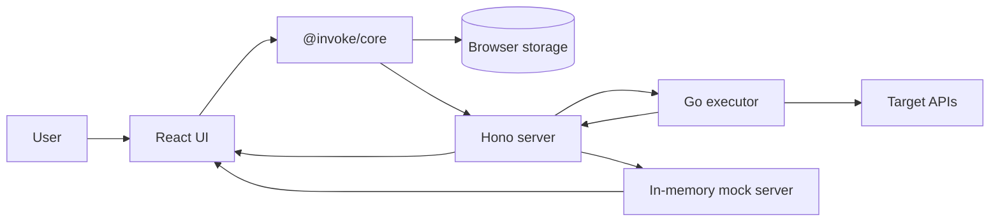

# invoke

invoke is a local-first API development, debugging, and testing platform for developers who want a fast browser UI, self-hosting, accurate network timing, and no mandatory account or cloud sync.

It combines a React web app, a TypeScript core engine, a thin Node.js proxy, and a Go executor. The browser owns the product state, the core engine handles API-client behavior, and the Go executor performs network I/O with low-level timing data that browser-only tools cannot capture reliably.

## Overview

- **Local-first by default** - collections, environments, history, flows, cookies, response examples, mock routes, and settings live in browser storage.
- **No required account** - use the app without sign-up, user management, or a hosted workspace.
- **Protocol-aware** - build and inspect REST, GraphQL, WebSocket, gRPC (unary, server-streaming, client-streaming, bidirectional), and streaming HTTP requests in one interface.
- **Accurate execution data** - capture detailed HTTP timing through a Go executor using `net/http/httptrace`.
- **Repeatable API checks** - run assertions, extraction rules, scripts, request flows, collection runs, and batch runs locally across all protocols.
- **Portable API work** - import existing API work, export OpenAPI specs, workspace backups, and code snippets, then self-host with Docker Compose.

## Features

### Request Building

invoke can create, send, save, and inspect API requests across multiple protocols:

**REST / HTTP:**

- Common HTTP methods and custom methods (PROPFIND, MKCOL, etc.).
- Form-data body with per-part type, filename, and content-type.
- URL-encoded body with proper encoding.
- File upload and binary body mode.
- Separate connect, read, and total timeouts.
- HTTP/2 with ALPN negotiation and protocol display.
- Connection pooling with configurable idle connections and max connections per host.
- Request cancellation via AbortController.
- Retry visibility with per-attempt timing.

**GraphQL:**

- GraphQL syntax highlighting via `@codemirror/lang-graphql`.
- Schema-aware autocomplete for fields, arguments, enums, fragments, and directives.
- Query validation against the fetched schema with inline diagnostics.
- Operation picker for multi-operation documents.
- Variables panel with auto-detection of `$variables` from the query and type hints.
- Full introspection coverage including input objects, enums, unions, interfaces, scalars, deprecation markers, and directives.
- Schema explorer with search, type navigation, breadcrumb stack, and SDL view.
- Schema persistence per endpoint with refresh and diff notifications.
- SDL import from paste or file when introspection is disabled.
- Prettify / format query action.
- Subscriptions over `graphql-ws` and `graphql-transport-ws` protocols.
- File uploads via the `graphql-multipart-request-spec`.
- Batched queries (array body).
- Automatic Persisted Queries (APQ) with hash-only-first and fallback.
- `@defer` / `@stream` incremental delivery via `multipart/mixed`.
- Fragments library with saved fragments per workspace.
- Dedicated `errors[]` panel with message, path, locations, and extensions.

**WebSocket:**

- Text and binary frame composer with file picker for binary payloads.
- Authentication on handshake (bearer, basic, api-key, OAuth2, SigV4 injected into upgrade headers).
- Multiple concurrent sessions per request (tabbed).
- Auto-reconnect with configurable exponential backoff.
- Saved messages and composer presets with send-on-connect queue.
- Ping/pong heartbeat with live latency display.
- Close frame with code and reason (send and receive).
- Handshake details panel (request/response headers, negotiated subprotocol, extensions, TLS info, handshake RTT).
- `permessage-deflate` compression toggle.
- Real-time inbound delivery via SSE (sub-100ms latency, replacing HTTP polling).
- Protocol presets: `graphql-transport-ws`, `graphql-ws`, MQTT-over-WS, STOMP, SignalR, Socket.IO templates.
- JSON pretty-print and hex/raw view for received frames.
- Session transcript export (JSON, NDJSON, text).
- Log toolbar with search, filter, pause/resume, and clear.
- Cookie injection on handshake from the cookie store.

**gRPC:**

- Server reflection with v1 and v1alpha fallback.
- Unary, server-streaming, client-streaming, and bidirectional streaming calls.
- `.proto` file upload and pre-compiled `FileDescriptorSet` import when reflection is disabled.
- gRPC-Web transport (`application/grpc-web+proto`, `application/grpc-web-text`).
- Structured body editor with enum dropdowns, repeated field lists, oneof radio groups, and map key/value rows alongside the JSON editor.
- Method search and filter with fuzzy matching and service grouping.
- Inline schema viewer showing field names, types, comments, and enum values from the descriptor.
- Connection pooling with keepalive (30s ping, 10s timeout) and channel reuse.
- Per-call compression toggle (none / gzip).
- Reflection cache persisted in IndexedDB per address.
- Collection-scoped proto registry shared across requests.
- Saved message templates per method.
- Stream UI with sent/received columns, per-message timing, and transcript export.
- Health check probe via `grpc.health.v1.Health/Check`.

REST requests support headers, query parameters, request bodies, auth configuration, variable resolution, retry policies, timeouts, TLS options, cookie handling, and proxy settings.

### Response Inspection

The response view is designed for debugging:

- Status, headers, body, request & response size, and timing summary.
- JSON and raw response display.
- DNS, TCP, TLS, TTFB, transfer, and total timing.
- Timing waterfall visualization.
- Redirect tracking with per-hop response details.
- TLS certificate details for HTTPS requests.
- HTTP version and ALPN protocol display.
- Assertion results after request execution.
- Saved response examples for collection requests.
- Captured cookies from `Set-Cookie` headers.
- History entries that preserve request and response context.
- Per-attempt timing chart for retried requests.

**gRPC response view:**

- gRPC status code and name (OK, NOT_FOUND, INVALID_ARGUMENT, etc.).
- Status message and decoded `google.rpc.Status` details (BadRequest, RetryInfo, DebugInfo).
- Initial metadata and trailers as separate panels.
- Per-message timing in server-streams and bidi-streams.
- Message count and compression ratio.
- Stream transcript with collapsed/expanded JSON per message.

### Collections and Environments

API work is organized locally in the browser:

- Collections for saved requests.
- Nested folders for larger APIs.
- Environments for local, staging, production, or custom variable sets.
- Scoped variables across environment, collection, folder, request, session, and flow contexts.
- Dynamic variables such as UUIDs and timestamps.
- Variable autocomplete for `{{...}}` placeholders in the request URL.
- Sensitive environment variables with `.env` import and export support.
- Searchable history for previously executed requests.
- Workspace JSON backup and restore for local project portability.

The core variable system resolves `{{variable}}` placeholders before execution, so saved requests can move between environments without duplicating URLs, tokens, or host-specific values.

### Auth, TLS, and Network Options

invoke includes common authentication and transport options used by real services:

- No auth.
- Basic auth.
- Bearer token.
- API key in header or query.
- OAuth2 client credentials.
- OAuth2 authorization-code helper with PKCE (S256) and refresh-token rotation.
- OAuth2 implicit, device flow, and OIDC `id_token`.
- Digest auth.
- AWS SigV4 signing (with session token support).
- NTLM auth.
- Cookie manager with persisted cookie jar support.
- mTLS client certificates.
- Custom CA bundles.
- TLS verification controls.
- HTTP proxy configuration.

Auth is applied to all protocols:

- REST/GraphQL: resolved into the outgoing HTTP request.
- WebSocket: injected into handshake upgrade headers.
- gRPC: translated into `authorization` metadata (bearer, basic, api-key, OAuth2, SigV4).

These options are resolved into the final outgoing request before the Node server forwards execution to the Go sidecar.

### Testing and Automation

invoke includes local testing primitives so requests can become repeatable checks:

- Assertions for status, headers, response time, JSONPath values, regex checks, and JSON Schema validation.
- Extraction rules that pull values from response bodies, headers, status, timing, or cookies.
- Session and flow variables for chaining request data.
- Pre-request and post-response scripts.
- Browser Worker script execution path with a Node/test fallback.
- Postman-style `test()` helper and `expect()` matchers.
- Per-request retry policies with retryable status codes, network-error retrying, and backoff configuration.
- Collection and folder runner with local progress, assertion results, and JSON/CSV report export.
- Batch runner for repeated request execution with iterations, concurrency, delay, stop-on-failure, and latency stats.
- Flow runner with request steps, delays, conditions, loops, extraction, cancellation, progress hooks, and saved flow persistence.
- Browser flow editor in Settings with saved flows, request/delay steps, reordering, execution, and live step logs.

**WebSocket assertions and scripts:**

- Assertions on received frames: body (JSONPath), frame type, direction, with index selectors (first, last, nth, any).
- Pre-connect and post-close scripts.
- `onMessage` hook that runs per inbound frame with `frame`, `session.send`, `session.close` exposed.

**gRPC assertions, extraction, and scripts:**

- Assertions on `grpc.statusCode`, `grpc.statusMessage`, `grpc.bodyJson` (JSONPath), `grpc.metadata[key]`, `grpc.trailers[key]`, `grpc.durationMs`.
- Stream message index selectors (first, last, nth, any) for server-stream and bidi assertions.
- Extraction rules from response body, metadata, and trailers into session variables.
- Pre-request and post-response scripts with `pm.request.metadata.add`, `pm.environment.set`, `pm.expect`.
- `onStreamMessage` hook for server-stream and bidi-stream messages.
- gRPC requests as flow steps with assert/extract/scripts support.
- Protocol-aware collection runner that dispatches REST, GraphQL, and gRPC requests.

### Diffing and History

Response history is useful for more than re-running a request:

- Search previous executions.
- Restore a historical request into the builder.
- Pin and label important history entries.
- Configure history retention while preserving pinned entries.
- Compare saved responses.
- Diff structured JSON responses.
- Ignore noisy JSON paths in response diffs.
- Fall back to text diffing for non-JSON bodies.
- Review assertion results from previous runs.

### Mock Server

invoke can run browser-managed mock routes through the Node server:

- Mock endpoints are served under `/mock/*`.
- Mock server management is available from the app settings.
- Routes are configured from browser state.
- Path parameters are supported.
- Conditions can inspect headers, query values, and JSONPath body values.
- Responses can include dynamic variables.
- Routes can cycle through response sequences.
- Latency can be configured.
- Request logs show incoming mock traffic.
- Webhook receiver endpoints can capture incoming requests, show logs, and enforce simple validation settings.
- Proxy recording can capture upstream traffic and turn it into mockable route data.

**gRPC mock server:**

- Accept a `FileDescriptorSet` and a map of canned responses keyed by full method.
- Serve unary and server-streaming mock responses for offline, CI, and demo use.
- Connection record/replay for regression testing against captured transcripts.

Mock state is intentionally local and in-memory on the Node side. The browser remains the owner of the mock configuration and can re-sync it when needed.

### Import, Export, and Code Generation

invoke is built to fit existing API workflows:

Supported imports:

- Postman collection format (including gRPC requests from Postman ≥ v10).
- OpenAPI 3.x.
- cURL paste.
- Insomnia export (including gRPC workspace items).
- Hoppscotch export.
- HAR files from browser DevTools.
- invoke ZIP/YAML export format.
- `grpcurl` command paste.

Supported exports:

- OpenAPI 3.0.3 YAML from REST collections.
- Workspace JSON backup.
- `.env` environment files.
- Copy as `grpcurl` / `buf curl` command.

Code export targets include:

- cURL.
- JavaScript `fetch`.
- Node `fetch`.
- Node `axios`.
- Python `requests`.
- Python `httpx`.
- Go `net/http`.
- Java OkHttp.
- Kotlin OkHttp.
- Ruby `Net::HTTP`.
- PHP Guzzle.
- C# `HttpClient`.
- Rust `reqwest`.
- PowerShell.
- HTTPie.

**WebSocket code generation:**

- `wscat`.
- `websocat`.
- JavaScript `WebSocket`.
- Node `ws`.
- Python `websockets`.
- Go `nhooyr.io/websocket`.

**gRPC code generation:**

- `grpcurl` command.
- Go `google.golang.org/grpc`.
- Node `@grpc/grpc-js`.
- Python `grpcio`.
- Java `io.grpc`.
- C# `Grpc.Net.Client`.
- Kotlin `grpc-kotlin-stub`.

## Architecture



The browser is the source of truth for workspace data. Requests are resolved in the UI and core layer, forwarded through the Node server, executed by the Go sidecar when network access or timing detail is needed, and returned to the response viewer.

### Browser UI

The React app is the main product surface. It renders the request builder, response viewer, collection tree, environment editor, protocol clients, history, collection runner, batch runner, cookie manager, mock/webhook tools, flow editor, settings, and import/export tools.

The UI imports `@invoke/core` directly. That keeps the app responsive and lets most business logic run near the browser-owned data.

### Core Engine

`@invoke/core` is a TypeScript package that contains the shared product logic:

- Request and response types.
- Variable resolution.
- Dynamic variables.
- Auth helpers.
- Assertions.
- Extraction.
- Diffing.
- Diff ignore rules.
- Cookie parsing and matching.
- Flow execution.
- Collection and batch run orchestration.
- Import/export.
- Workspace backup parsing and serialization.
- Code generation.
- Storage helpers.
- Script execution helpers.

The browser-safe core entry point must not depend on Node-only APIs. This matters because the UI build should work without leaking modules such as `fs`, `path`, native gRPC clients, or server-only sandbox implementations into the browser bundle.

### Node Server

The server is intentionally thin. It does not own the user's collections or environments in the local-first model.

Its responsibilities are:

- Forward resolved HTTP requests to the Go executor.
- Forward streaming responses.
- Relay WebSocket operations via real-time SSE transport.
- Proxy gRPC reflection, unary, server-streaming, client-streaming, and bidirectional streaming execution.
- Host the in-memory mock server (HTTP and gRPC).
- Host webhook capture routes and logs.
- Support OAuth2 authorization-code callback handling.
- Apply auth configuration to outgoing requests across all protocols.
- Serve as the bridge between browser APIs and the Go sidecar.

### Go Executor

The Go executor performs network operations that need more control than browser APIs provide:

- HTTP request execution with connection pooling and HTTP/2.
- DNS, TCP, TLS, TTFB, transfer, and total timing.
- TLS certificate inspection.
- Redirect handling.
- Streaming response execution.
- WebSocket connection management with `nhooyr.io/websocket`, ping/pong, `permessage-deflate`, and proper close handshake.
- gRPC reflection (v1 and v1alpha), unary, server-streaming, client-streaming, and bidirectional streaming execution with keepalive.
- gRPC-Web transport.
- mTLS and custom CA handling.
- SSRF guard with configurable address denylist.

The executor communicates with the Node server through gRPC. The contract lives in `proto/executor.proto`.

## Local Data Model

invoke's local-first model is simple:

- Collections live in browser storage.
- Environments live in browser storage.
- Request history lives in browser storage.
- Cookies live in browser storage.
- Response examples live in browser storage.
- History retention settings live in browser storage.
- Diff ignore rules live in browser storage.
- Saved flows live in browser storage.
- GraphQL schema cache lives in browser storage (per endpoint).
- gRPC reflection cache lives in browser storage (per address).
- Proto registries live in browser storage (per collection).
- Mock configuration is managed by the browser.
- Webhook logs and mock runtime state are in memory on the Node server.
- No account is required to use the app.
- No database is required for local or self-hosted use.

The Node server and Go executor see resolved requests when you execute them, because they have to send the network traffic. They are not the source of truth for your workspace data.

Self-hosting keeps the proxy and executor under your control. This is important when testing internal APIs, private services, local development servers, or endpoints that use sensitive credentials.

## Repository Structure

```text
.
|-- executor/                 Go executor and gRPC service implementation
|-- packages/
|   |-- core/                 TypeScript core engine
|   |-- server/               Hono server, proxy routes, streaming, mock host
|   `-- ui/                   React browser application
|-- proto/                    Executor protobuf contract
|-- tests/e2e/                Playwright end-to-end tests
|-- docs/                     Product and implementation documentation
|-- Dockerfile.executor       Executor image
|-- Dockerfile.server         Server image
|-- Dockerfile.ui             UI image
|-- docker-compose.yml        Self-hosted production compose file
|-- docker-compose.dev.yml    Development compose file
`-- package.json              Root workspace scripts
```

## Getting Started

### Requirements

- Node.js 20 or newer.
- pnpm 9 or newer.
- Go.
- Docker and Docker Compose for containerized self-hosting.
- Buf CLI only when regenerating protobuf code.

PowerShell may block `pnpm.ps1` depending on local execution policy. If that happens, use `pnpm.cmd`.

### Install Dependencies

```bash
pnpm install
```

### Run the Full Local Stack

`pnpm dev:all` starts the Go executor, Node server, and React UI together with labeled output:

```bash
pnpm dev:all
```

`pnpm dev` starts only the Node server and React UI (skips the executor — useful when the executor is already running or you don't need network timing):

```bash
pnpm dev
```

Open:

```text
http://localhost:3000
```

### Run Services Separately

If you prefer separate terminals:

```bash
pnpm executor:dev
```

```bash
pnpm dev:server
```

```bash
pnpm dev:ui
```

Open:

```text
http://localhost:3000
```

## Self-Hosting

Run the complete stack with Docker Compose:

```bash
docker compose up --build
```

Open:

```text
http://localhost:8080
```

The compose stack builds and runs the UI, Node server, and Go executor. The UI is served through Nginx, the server handles API routes, and the executor performs outbound API calls.

## Development Commands

Root workspace commands:

```bash
pnpm dev
pnpm dev:all
pnpm dev:server
pnpm dev:ui
pnpm executor:dev
pnpm build
pnpm test
pnpm lint
pnpm e2e
pnpm proto:generate
pnpm executor:test
```

Useful package-level commands:

```bash
pnpm --filter @invoke/core test
pnpm --filter @invoke/core build
pnpm --filter @invoke/server test
pnpm --filter @invoke/server build
pnpm --filter @invoke/ui test
pnpm --filter @invoke/ui build
```

Go executor tests can also be run directly:

```bash
cd executor
go test ./...
```

## Verification

Before treating a change as ready, run:

```bash
pnpm lint
pnpm build
pnpm test
pnpm e2e
pnpm executor:test
```

`pnpm e2e` uses Playwright. The test setup starts the Go executor, Hono server, Vite UI, and a local mock target API before running browser tests.

For Go-only changes:

```bash
cd executor
go test ./...
```

For protobuf changes:

```bash
pnpm proto:generate
pnpm build
```

## Protobuf

The executor service contract is defined in:

```text
proto/executor.proto
```

Generated Go files are checked in under:

```text
executor/internal/executorpb
```

Regenerate protobuf output with:

```bash
pnpm proto:generate
```

Do not hand-write generated protobuf types. Update the `.proto` file and regenerate.

## Working With the Core Package

`@invoke/core` is the shared logic layer. Keep it framework-independent and browser-safe unless a module is explicitly server-only.

When adding to core:

- Keep browser-safe exports free of Node.js built-ins.
- Prefer pure functions for request transformation, assertions, code generation, import/export, and variable handling.
- Keep storage behind interfaces where possible.
- Add focused unit tests for behavior that can break saved work, imports, exports, variable resolution, assertions, or generated code.

Browser compatibility is verified through the UI build:

```bash
pnpm --filter @invoke/ui build
```

If the UI build fails because a Node module leaked into the browser bundle, fix the import boundary rather than masking it with a polyfill.

## Working With the Server

The server should stay small and operationally boring. It is a bridge, not the workspace database.

Expected server responsibilities:

- Validate incoming execution requests.
- Forward work to the Go executor.
- Stream responses back to the browser.
- Relay protocol-specific operations.
- Apply auth configuration to outgoing requests across all protocols.
- Proxy gRPC reflection, unary, server-streaming, client-streaming, and bidirectional streaming execution.
- Host mock routes from browser-provided configuration (HTTP and gRPC).
- Host webhook capture routes and logs.
- Support OAuth2 authorization-code callback handling.
- Normalize errors into UI-friendly responses.

Avoid adding collection, environment, history, or flow CRUD routes unless the storage model changes deliberately.

## Working With the Executor

The executor is responsible for network correctness. Changes here should be tested with Go unit tests and, when possible, end-to-end browser coverage.

Important areas:

- Timing instrumentation.
- Redirect behavior.
- TLS and mTLS handling.
- Custom CA handling.
- Request cancellation and timeouts.
- Streaming responses.
- Connection pooling and keepalive.
- WebSocket lifecycle (ping/pong, close handshake, compression).
- gRPC reflection (v1 + v1alpha), unary, server-streaming, client-streaming, and bidirectional streaming execution.
- gRPC-Web transport.
- SSRF guard enforcement.

Run:

```bash
cd executor
go test ./...
```

## Data Ownership

Because invoke is local-first, browser storage is important product state. Be careful with migrations and data shape changes.

When changing persisted data:

- Preserve existing IndexedDB data where possible.
- Add migrations instead of assuming a clean browser profile.
- Keep exported files readable and deterministic.
- Avoid changing import/export formats without compatibility handling.
- Test refresh and reload behavior after saving collections, environments, flows, history, cookies, response examples, and settings.
